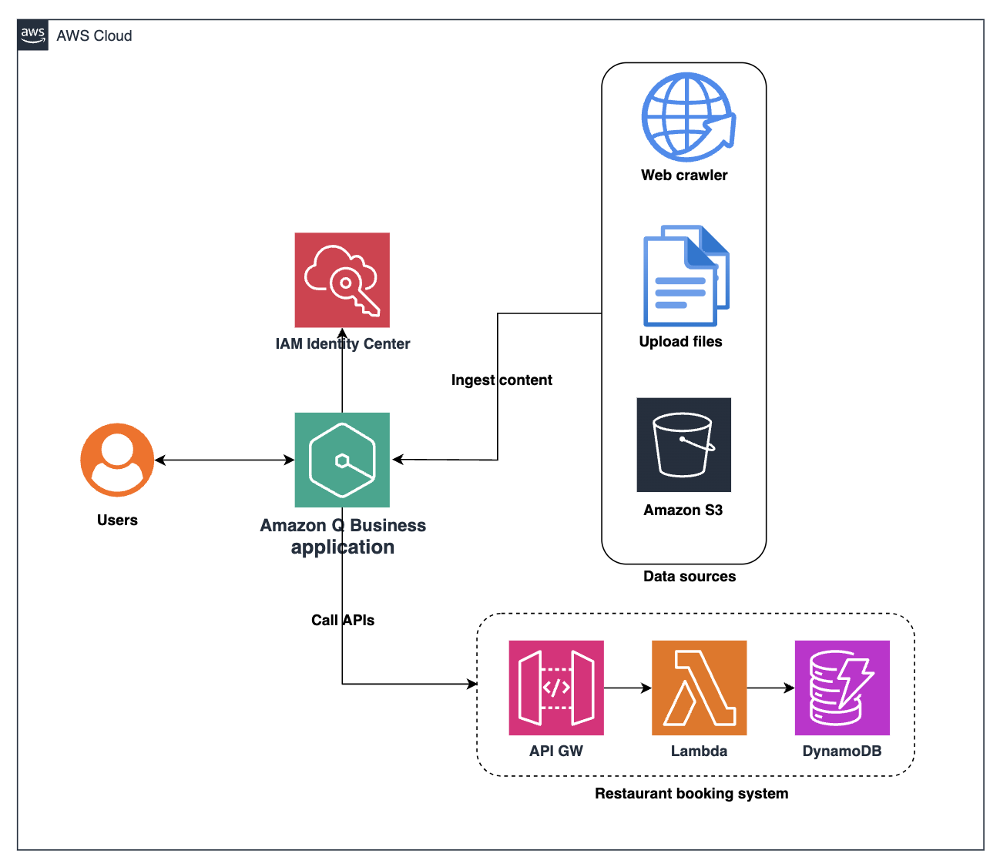

# Amazon Q Business Workshop - "Chat with your documents and systems"

## About the workshop
Amazon Q Business is a generative AI assistant offering a unified conversational experience to access enterprise knowledge. It can generate summaries, extract key insights, accelerate content creation, and streamline tasks. This workshop will guide you through setting up and using Amazon Q Business step-by-step.

## What it covers
- Creating an Amazon Q Business application
- Asking questions about your knowledge bases
- Managing admin controls and adjusting guardrails
- Chatting with your system using natural language

## Managed RAG options on AWS
To manage Retrieval Augmented Generation (RAG) workflows on AWS, you can choose between custom RAG pipelines or fully managed AWS services is a kind of options. While fully managed services streamline operations by handling much of the undifferentiated heavy lifting with their core components, they provide fewer opportunities for customization.
As stated in the [AWS Prescriptive Guidance](https://docs.aws.amazon.com/prescriptive-guidance/latest/retrieval-augmented-generation-options/introduction.html), the following managed options are currently available on AWS:
- Knowledge bases for Amazon Bedrock
- Amazon Q Business
- Amazon SageMaker Canvas

According to AWS, Amazon Q Business is the top recommended choice for a fully managed RAG solution. However, you should consider alternative options if your requirements fall into one of the following scenarios:
- The service is unavailable in your AWS region, and moving data to a supported region is not feasible.
- Your RAG workflow requires customization beyond the standard capabilities of Amazon Q Business.
- You need to use an existing vector database or integrate a specific LLM.  

## :hammer_and_wrench: Getting started
In this workshop, we’ll delve into the capabilities of Amazon Q Business, utilizing documents and systems from Labs 5 and 8 of the [Amazon Bedrock Agents Workshop](https://catalog.workshops.aws/agents-for-amazon-bedrock/en-US). The lab environment was customized with a custom plugin, building on the [AWS workshop - Innovate on enterprise data with generative AI & Amazon Q Business application](https://catalog.workshops.aws/amazon-q-business/en-US/110-what-you-will-build).  

What you need 
- An [AWS account](https://docs.aws.amazon.com/accounts/latest/reference/getting-started.html)
- An IAM User with the AdministratorAccess policy

Then, follow the below instructions to get hands-on!
1) [Lab Infrastructure setup](infra)  
2) [Amazon Q Business application setup](q-app)
3) [Knowledge Base setup](knowledge)
4) [Amazon Q Business chat](chat)
5) [Admin controls and guardrails configuration](guardrail)
6) [Custom plugins integration](custom)  
