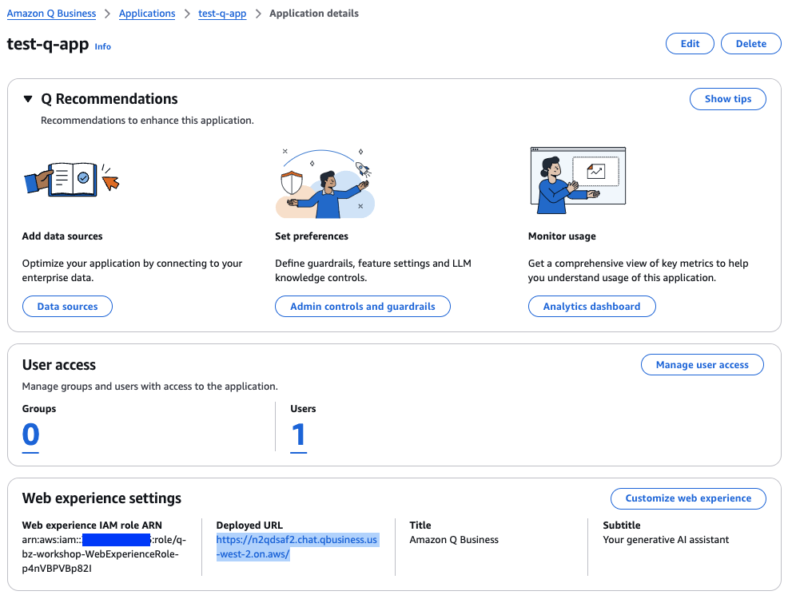
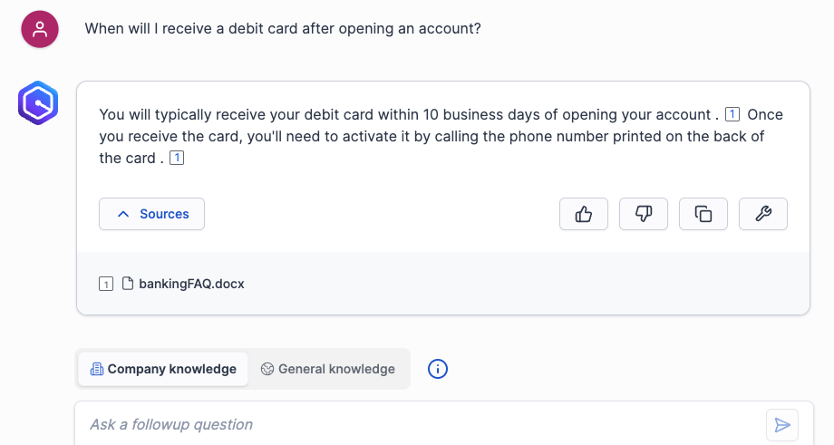
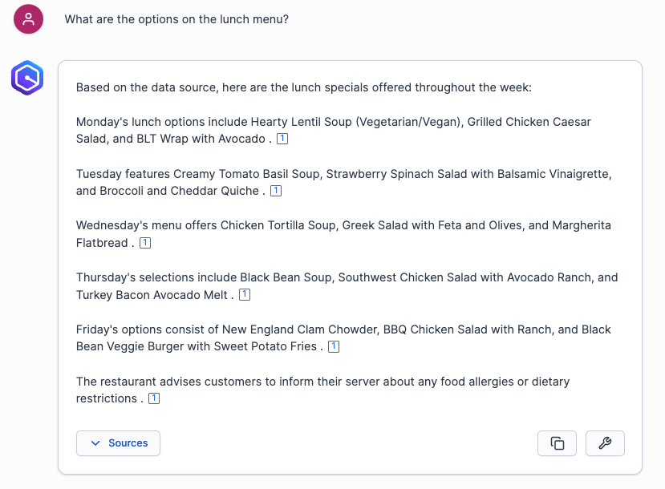
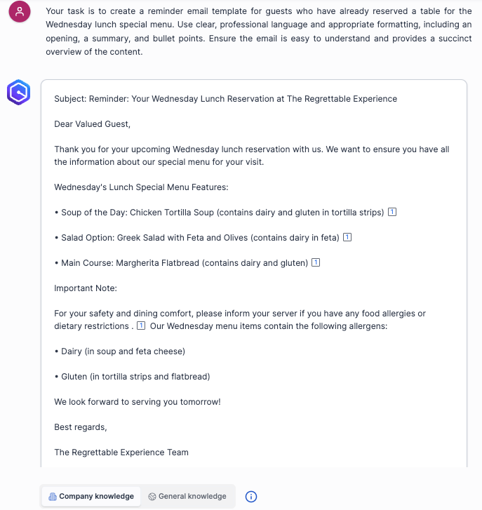

# Amazon Q Business application chat
We will chat with Amazon Q Business application using questions relevant to data sources.

1. Go to the application details page and click on the url below **Deployed URL**.  

You will be asked to sign in using the username, *doit*, that we reset its password [in the IDC setup](../q-app/README.md#iam-identity-center-setup).  After sign-in, The application is shown as below.  
  

2. As you can see tabs above the chat textbox. There are Company knowledge and General knowledge. If Company Knowledge is selected, the application retrieves information from the configured knowledge bases to respond to the user. In contrast, when General Knowledge is chosen, the application relies on model knowledge derived from trained data to interact with the user.  
To understand better, please check the below examples using this question `When was Amazon Q Business released?`.   

Ask using Company Knowledge.  
  
Ask using General Knowledge.  
  

3. Let's ask questions relevant to data sources we configured previously.  
Ask a question `How many fully managed Retrieval Augmented Generation (RAG) options does AWS offer, and which one is the first recommended by AWS?`.  
  
As you can see the source the application uses to answer us from the Web crawler data source.  

Next, ask this question `When will I receive a debit card after opening an account?`.  
  
The application uses the source from the Uploaded file data source.  

Ask another `What are the options on the lunch menu?`.  
  
The source is from the S3 data source.  

In addtion to do Q/A, you can ask the application to generate insights from knowledge and create new content as well. For example, we will ask Amazon Q Business to create a reminder email for guests booking a restaurant table.

Use the query `Your task is to create a reminder email template for guests who have already reserved a table for the Wednesday lunch special menu. Use clear, professional language and appropriate formatting, including an opening, a summary, and bullet points. Ensure the email is easy to understand and provides a succinct overview of the content.`.   
  
As you can see, the email template is generated with Wednesday's lunch special menu.

Since users can ask any information from Q Business, this may introduce risks or lead to unintended usage.  
[Next](../guardrail), we will manage user input using admin controls and guardrails.