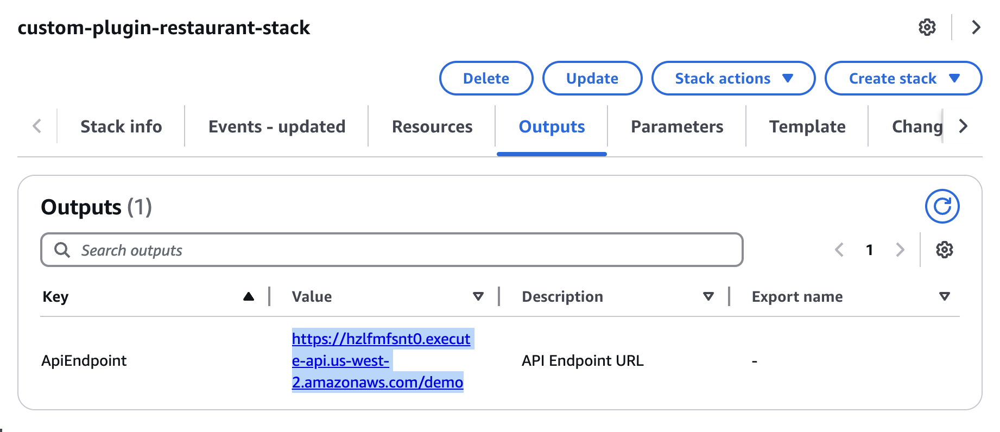

# Custom plugins
In addition to built-in plugins, Amazon Q can be integrated with various third-party applications. Users can leverage natural language to query information and perform actions seamlessly.

## Setting up a System & Plugin
1. Download [the CloudFormation template](../oas-restaurant-booking.yaml) onto your local machine.  
2. Open the AWS Management Console and navigate to [AWS CloudFormation](https://console.aws.amazon.com/cloudformation).  
3. Select **Create stack** with **New resources (standard)**, then **Choose an existing template**, **Upload a template file**, click on **Choose file** and then upload the Cloudformation template you downloaded, and click **Next**.  
  
4. Input a stack name `custom-plugin-restaurant-stack`, Then select **Next**.  
  
5. Scroll down to the bottom, and check "I acknowledge that AWS CloudFormation might create IAM resources.". Then select **Next**.  
6. Scroll down to the bottom of the page and click *Submit*. Wait around 5 minutes until the CloudFormation stack status to be *CREATE_COMPLETE*.  
  
7. Go to **Outputs** tab and Copy the value of the ApiEndpoint key and save it, as you’ll need it for the custom plugin configuration.  
  

## Custom plugin setup
1. Navigate to [Amazon Q Business](https://console.aws.amazon.com/amazonq/business).  
2. Click on the **Plugins** section under Enhancements, click **Add Plugin**.  
  
Then select **Custom plugin**.  
  
3. Provide **Plugin name** `restaurant-booking-plugin` and **Description** `API for booking a table in the restaurant`.  
  
4. Download [the API schema](../oas-restaurant-booking.yaml) to your local machine.  
5. Under **API schema**, select *Define with in-line OpenAPI schema editor*.  
Select *YAML* as the format.  
Copy the API schema content that you previously downloaded and edit the URL value on line 7 with the API Gateway endpoint saved in the previous section (step 7).  
  
6. In **Authentication** section, select *No authentication required*, and click **Add plugin**.  
  
7. Wait a few minutes. The plugin will be ready to use.  
  

## Conversing with a System
