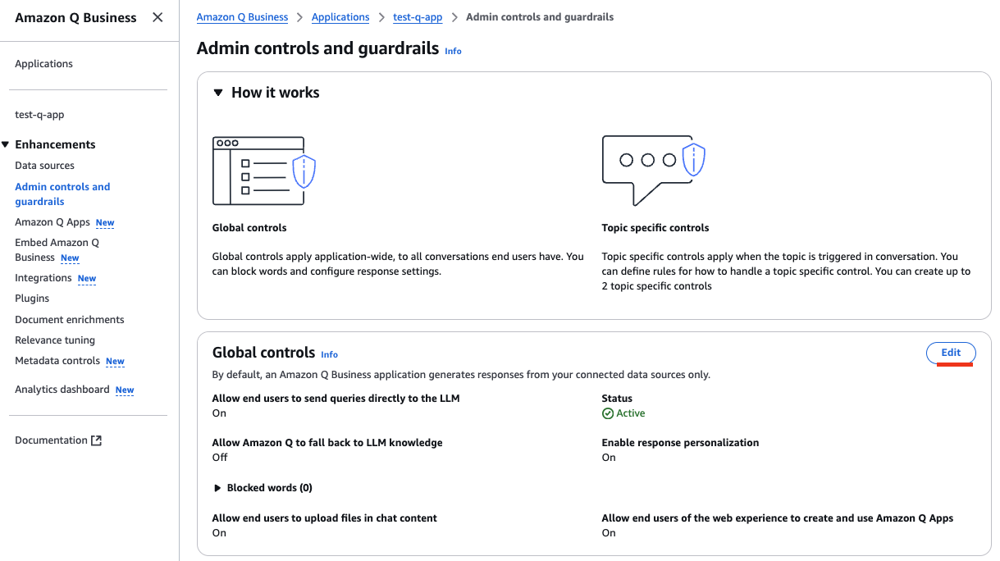
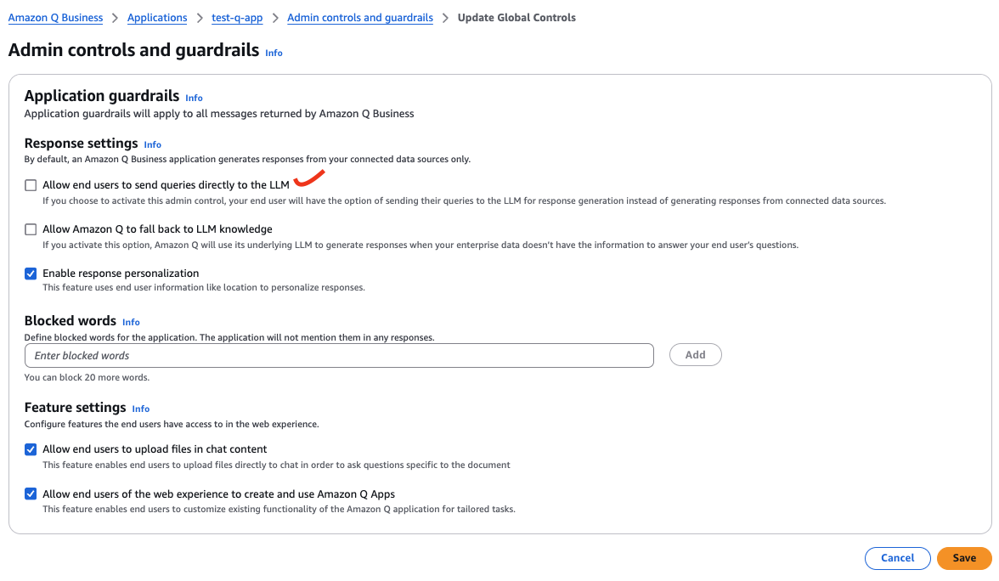
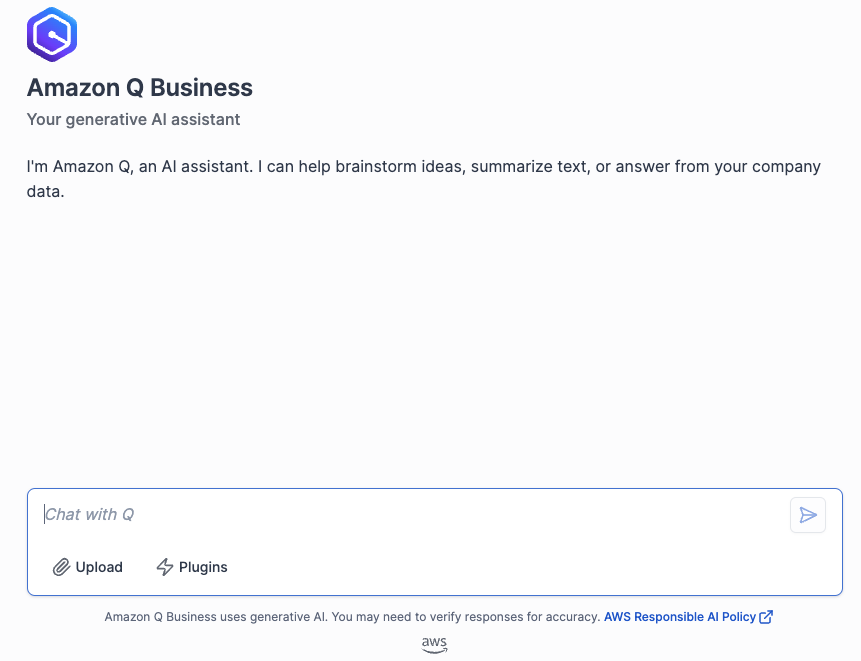
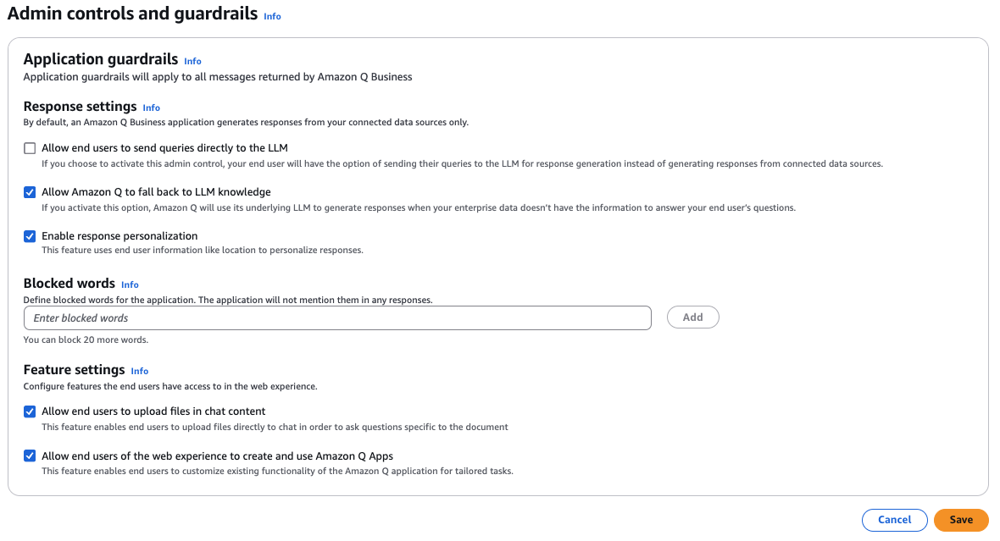
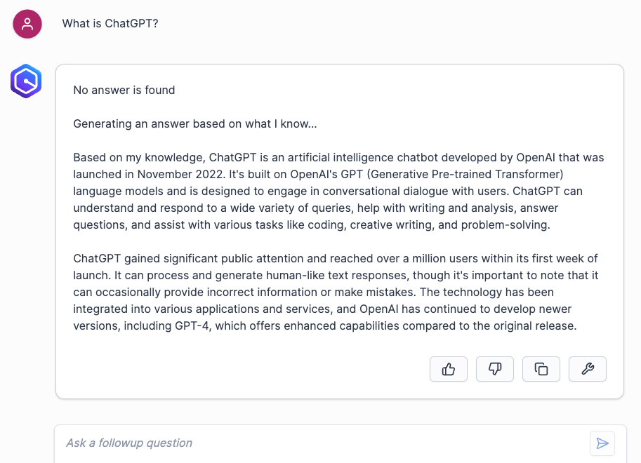
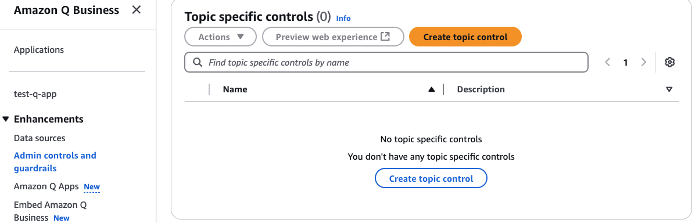
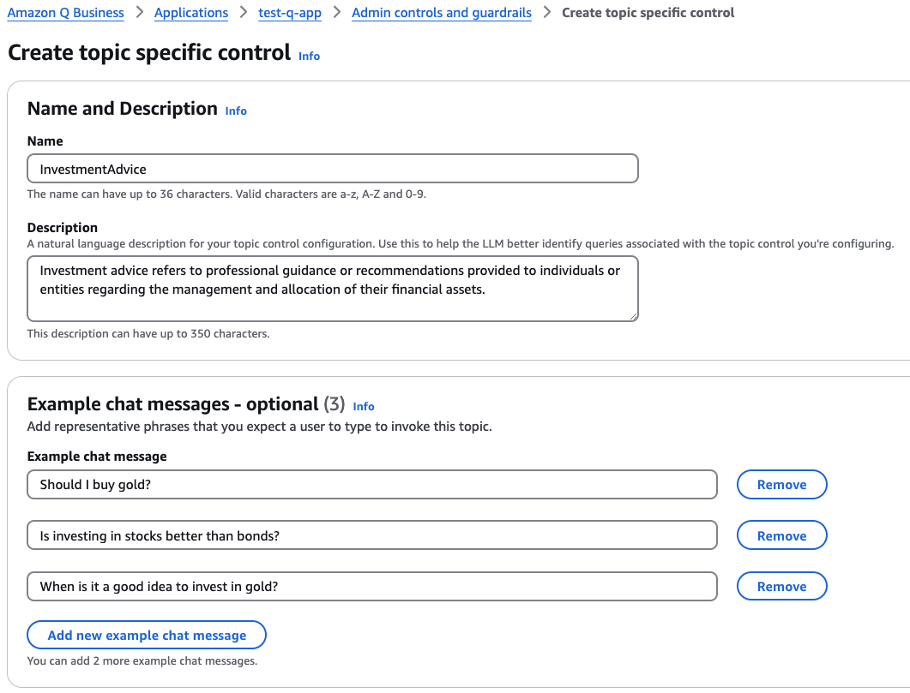
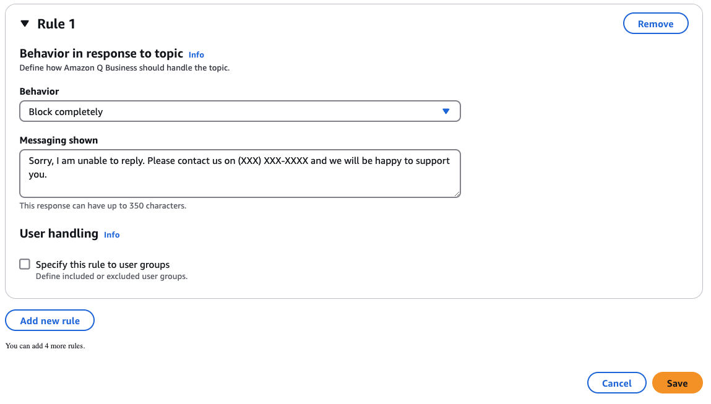
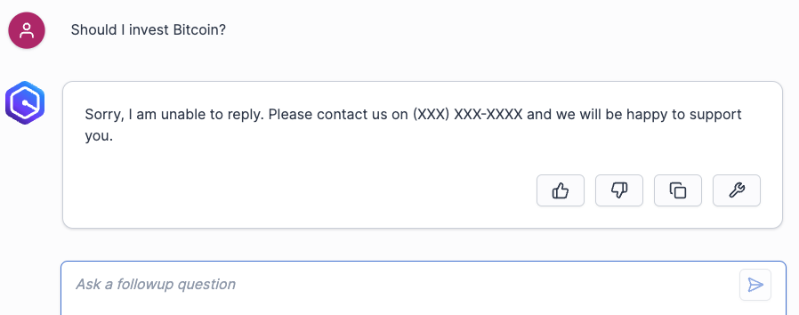

# Admin controls and guardrails
We are going to configure admin controls and guardrails to control the application.

## Global controls

1. On the left naviation, under **Enhancements**, choose *Admin controls and guardrails*. In **Global controls** section then click **Edit**.  
  

2. In **Application guardrails** section, under **Response settings**, uncheck *Allow end users to send queries directly to the LLM*. And click **Save**.  
  

3. Open your Q application you can observe there is no Company Knowledge/General Knowledge tabs anymore. As a user is only allow to talk with company knowledge.  
  

4. Go back to **Global controls**. This time we check *Allow Amazon Q to fall back to LLM knowledge* and click **Save**.  
  

5. Go to your Q application and ask a question `What is ChatGPT`. And the reply indicates that no answer is found the Company Knowledge and the application retrieves the information from the model itself instead.  
  

## Topic specific controls
When your application encounters a specific topic, you can configure it to provide answers using enterprise data or block an input.  
1. On the left naviation, under **Enhancements**, choose *Admin controls and guardrails*. In **Topic specific controls** section then click **Create topic control**.  
  

2. Under **Name and Description** Enter **Name** `InvestmentAdvice`.  
For **Example chat message**, add the following messages. (click **Add new example chat message** to add another message)
`Should I buy gold?`  
`Is investing in stocks better than bonds?`  
`When is it a good idea to invest in gold?`  
  

3. Click **Add new rile**.  
In **Rule 1**, under **Behavior** select *Block completely*, and **Messaging shown** input `Sorry, I am unable to reply. Please contact us on (XXX) XXX-XXXX and we will be happy to support you.`, then click **Save**.  
  

4. Go to your application and ask the question `Should I invest Bitcoin?`. You will notice that the application responds with a block message.  
  

[The last section](../custom/README.md), we will integrate a 3rd party system with the Q application.