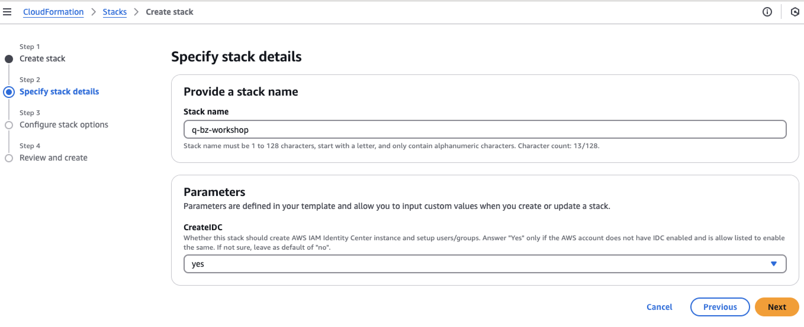
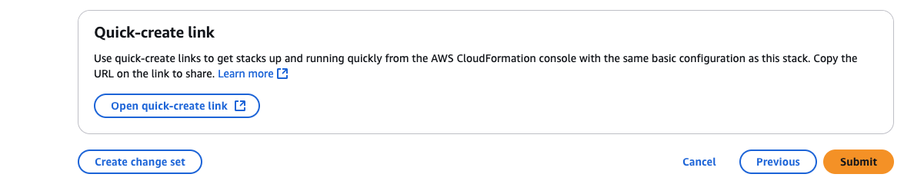
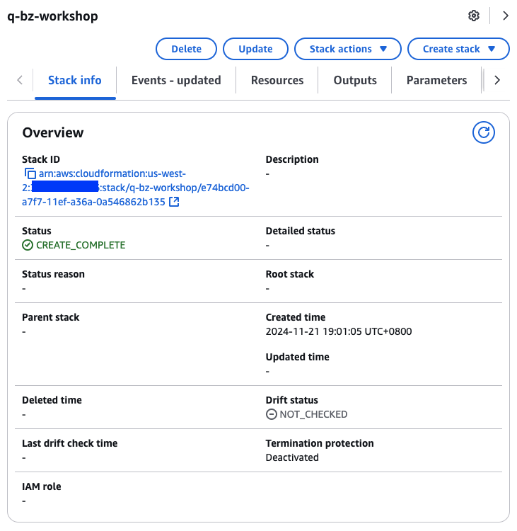

# Infrastructure setup
In this part we are going to deploy cloudformation templates to provision necessary resources for this lab. You can provision it on any AWS regions where Amazon Q Business is available.  

1. Download [the CloudFormation template](../cf-q-biz-setup.yaml) to your local machine.  
2. Open AWS console and navigate to [AWS CloudFormation](https://console.aws.amazon.com/cloudformation)  
3. Select **Create stack** with **New resources (standard)**, then **Choose an existing template**, **Upload a template file**, click on **Choose file** and then upload the Cloudformation template you downloaded, and click **Next**.  
  
4. Input a stack name `q-bz-workshop`. You need an IAM Identity Center(IDC) instance to be created if your AWS account is not managed by AWS Organizations and change CreateIDC parameter `yes`. Then select **Next**.  
  
5. Scroll down to the bottom, and check "I acknowledge that AWS CloudFormation might create IAM resources.". Then select **Next**.  
  
6. Scroll down to the bottom of the page and click *Submit*.  
  
7. Wait around 5 minutes until the CloudFormation stack status to be *CREATE_COMPLETE*.  
  
8. You can view created resources on Outputs.  
  

Now you are ready to experiment Amazon Q Business in [the next step](../q-app).  