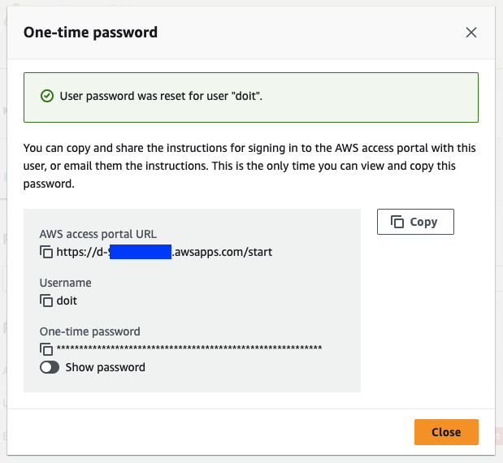
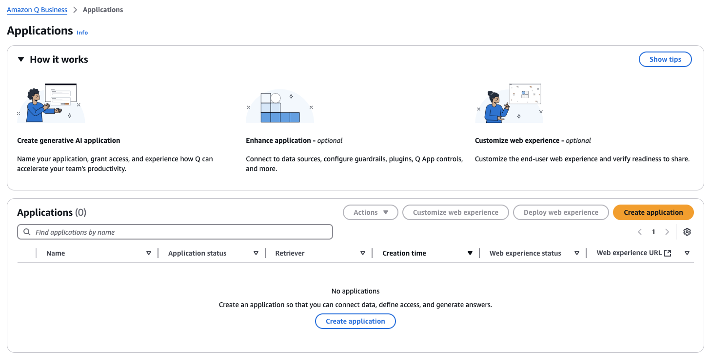

# Amazon Q Business application setup
From the previous setup, we also provisioed an account instance of IAM Identity Center with users and groups added. In order to access a Q application, we need to log in with a user created. So let's reset and update user password first.

## IAM Identity Center setup
1. Open AWS Console and navigate to [IAM Identity Center](https://console.aws.amazon.com/singlesignon/home)
2. On the left navigation bar, click on **Users** to review the list of users created.

You can also view the group.

3. We are going to reset a user password for sign-on to Amazon Q Business application web experience.  
Navigate to a user `doit` and click **Reset password** located at the top right of the page.
  
Choose *Generate a one-time password and share the password with the user*, and click **Reset password**.  
  
One-time password will be generated.  
  
Open AWS access portal URL in a new tab and sign in with a user name `doit` with the one-time password.  
Input your new password for next-time access.  
  
Repeat the same steps for the rest of users, if you would like to use other users.  

## Amazon Q Business application setup

1. Open AWS Console and navigate to [Amazon Q Business](https://console.aws.amazon.com/amazonq/business)
2. Click **Get started** and it wil navigate to Applications page. Then clice **Create application**.  

3. Enter Application name `test-q-app`.   

Under Access management method, select *AWS IAM Identity Center (recommended)*.
In Quick start user, select **doiT** under **Users**. Optionally, you can select **Allusers** under **Groups**.  
For **Select subscription**, select `Q Business Pro`.

4. Expand Application details.  
Under **Choose a method to authorize Amazon Q Business**, select *Create and use a new service-linked role (SLR)*.  
In Web experience settings, under **Choose a method to authorize Amazon Q Business**, select *Use an existing service role*, and for **Service role name** select the role containing the name `-WebExperienceRole-`.  
Then, click **Create**.  
  

5. After complete, you can use **Deployed URL** to access Amazon Q Business application

  